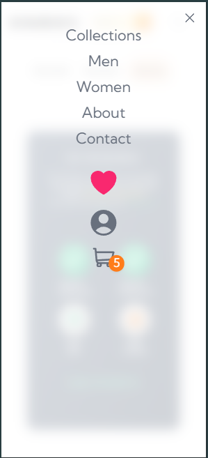

# My E-Commerce App Built Using Next Js

## Table of contents

- [Overview](#overview)
- [Screenshot](#screenshot)
- [Links](#links)
- [Built with](#built-with)
- [What I learned](#what-i-learned)
- [Continued development](#continued-development)
- [Useful resources](#useful-resources)
- [Author](#author)

## Overview

Originally conceived as a challenge to design a singular product page, this project quickly evolved into a comprehensive showcase of creative prowess and technical skill. Leveraging Next.js, I transformed the concept into a dynamic pseudo e-commerce platform. From seamless navigation to a robust product database and intuitive cart system, every aspect was meticulously crafted to deliver an immersive user experience. Fueled by a passion for creativity and a background in animation, I infused the platform with captivating visuals and interactive elements.

### Screenshot

### Links

- Live Site URL: (https://sneakers-oj.vercel.app/)

### Built with

- [React](https://reactjs.org/) - JS library
- [Next.js](https://nextjs.org/) - React framework
- [TypeScript]
- [FramerMotion](https://www.framer.com/motion/) - Animations
- [Tailwind](https://tailwindcss.com/) - Styling -[Stripe](https://stripe.com/gb?utm_campaign=UK_en_Search_Brand_Stripe_EXA-2032860449&utm_medium=cpc&utm_source=google&ad_content=604272871169&utm_term=stripe&utm_matchtype=e&utm_adposition=&utm_device=c&gad_source=1&gclid=Cj0KCQjwsaqzBhDdARIsAK2gqnf4ITEmH8dHSHK3pxNSZnzzbjqzct_1gY0LSAPFfrALf_O1g-AQLQoaAo8JEALw_wcB) - Payment Functionality
- Semantic HTML5 markup
- CSS custom properties
- Flexbox
- CSS Grid
- Desktop-first workflow

### What I learned

I Learned how to implement full-stack features into one project using Next JS and optimise assets for performance gain, including but not limited to (font, images, vectors, components).

I also learned about Server-Side Rendering (SSR) and Client-Side Rendering (CSR) seperation and its benefit towards better hydration and user experience for certain pages or components.

I leveraged the power of typescript to better maintain control over my components, functions, and data in general to better keep track of the appropriate types across the timespan of my project and avoid careless type errors / undefined values.

I learned how to use tailwind CSS to adopt a more mobile-friendly (first) workflow and the benefit of using their inbuilt classes for easier responsive design.

### Continued development

In future i would love to incorporate a more comprehensive database to reflect more realisitc product ranges and create a more refined 'search' tool as seen within the current industries. In addition to this, it would be great to implement a system to keep track of user clicks (using a heatmap like hotjar.js?) and frequently visited products that can use their personalised data to generate suggested products, thereby creating a more realistic and personalised user experience.

### Useful resources

- [Tailwind Docs](https://tailwindcss.com/) - A Must have for Tailwind Styling References. -[Hamed Bahram](https://www.youtube.com/@hamedbahram) - Next JS Tutorials -[Aceternity](https://ui.aceternity.com/) - NextJS Component Inspiration

## Author

Oliver J :

- Frontend Mentor - [@OllieJ23](https://www.frontendmentor.io/profile/OllieJ23)
